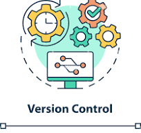

# Feature of VCS | Detailed documentation of VCS setup


| Created     |    Version   | Author | Comment |
|:------------------:|:-------------:|:-------------:|:-------------:|
| 11-11-2024   | V1   | Pritam Kondapratiwar | Initial Commit

## Table of Content
- [Introduction](#introduction)
- [Features of VCS](#feature)
- [VCS Setup](#VCS-setup)
    - [Installation](#installation)
    - [Configuration](#Configuration)
    - [Creating a Repository](#creating-a-Repository)
    - [Basic Git commands](#Basic-Git-commands)
- [Conclusion](#conclusion)
- [Contact](#contact)
- [References](#references)

## Introduction
> Version control, or source control, is a way of keeping track of changes made to code over time. It helps teams of developers manage and organize updates to their code so they can work together smoothly.
Version control software keeps track of every modification to the code  . The most popular version control systems, such as Git, Subversion (SVN), and Mercurial .

## Features of VCS

**Version control systems (VCS) have many features that help software teams work more efficiently, including:**
| Features    | Description
|:------------------:|:--------------------------:|
| History tracking  | VCS keeps a record of all changes to code, including who made them, when, and why. This history can be reviewed to help teams experiment and roll back to previous versions if needed.
| Branching and merging | VCS allows developers to work on different parts of a project simultaneously without interfering with each other.
| Collaboration | With VCS, multiple people can work on the same project simultaneously .
| Conflict Resolution | When multiple contributors edit the same file, VCS detects conflicts and provides tools to resolve them. 
| Backup and Restore | Facilitates reverting to previous versions of the project, ensuring recovery from errors or unintended changes.
| Continuous Integration/Continuous Deployment (CI/CD) Integration | VCS platforms can be integrated with Continuous Integration/Continuous Deployment (CI/CD) tools to automatically build, test, and deploy code.


## VCS Setup

**Below is a detailed guide for setting up Git, a popular distributed version control system.**

### **Installation:** 


**Windows**
> - Download the Git installer from [git-scm.com](https://git-scm.com/download/win)
> - Run the installer and follow the on-screen instructions. 
> - Select the default options unless you have specific preferences. 
  
**Linux**
> Open terminal and Install below packages .
```
sudo apt-get install git  # Debian/Ubuntu
sudo yum install git      # CentOS/RHEL
sudo dnf install git      # Fedora

```
**Mac-OS** 
> - Open Terminal.
> - Install Homebrew if it’s not already installed:
```
/bin/bash -c "$(curl -fsSL https://raw.githubusercontent.com/Homebrew/install/HEAD/install.sh)"
```
> - Install Git using Homebrew:
```
brew install git

```

### Configuration 

> - Open Terminal (or Git Bash on Windows).
> - Set your username and email address:
```
git config --global user.name "Your Name"
git config --global user.email "your.email@example.com"

```
> - Verify the configuration:
```
git config --list
```

### Creating a Repository 

**Initialize a New Repository:**


The git init command is used to initialize a new Git repository in your current directory. 

### Steps to initialize a Git repository: ###

```
mkdir my-project
cd my-project
```
```
git init
```
This will create a hidden .git directory in your project folder. 

**Clone an Existing Repository**

The git clone command is used to create a local copy of a remote Git repository.

```
git clone https://github.com/username/repository.git
```
### Basic Git Commands 

**Adding and Committing Changes**

> - Add changes to the staging area:
```
git add <filename>        #Add a specific file
git add .                 # Add all changes
```
> - Commit changes with a message:
```
git commit -m "Commit message describing changes"

```

**Branching and Merging**
> Create a new branch:
```
git branch <branch-name>
```
Switch to the new branch:
```
 git checkout <branch-name> #switch the branch
 git checkout -b <branch-name>  #switch as well as create branch 
```
Merge a branch into the current branch:

```
git merge <branch-name>

```
**Pushing and Pulling Changes**

Push changes to a remote repository:
```
git push origin <branch-name>
```
Pull changes from a remote repository:
```
git pull origin <branch-name>
```

### Conflict Resolution 

- When a conflict occurs, Git will highlight the conflicting sections in the files.
- Open the files and manually resolve the conflicts.
- After resolving conflicts, add the resolved files:
```
git add <filename>
```
 Commit the changes:
```
git commit -m "Resolved merge conflict"
```
## Conclusion

> Version Control Systems (VCS) are indispensable for modern software development, offering critical features like change tracking, branching, merging, and collaboration support. Setting up a VCS, such as Git, involves installation, configuration, and basic command usage, enabling efficient management of code versions and seamless teamwork. Utilizing VCS enhances code quality, facilitates project recovery, and ensures comprehensive change history, making it a vital tool for developers.


## Contacts

|    NAME           |   Email Address                       |
|:-----------------:|:-------------------------------------:|
|Pritam Kondapratiwar| 	|

## References

- Git Documentation: [Git Documentation](https://git-scm.com/doc)
- VCS Documentation : [VCS Documentation](https://www.atlassian.com/git/tutorials/what-is-version-control)
- GitHub Documentation: [GitHub Documentation](https://www.geeksforgeeks.org/introduction-to-github/)


